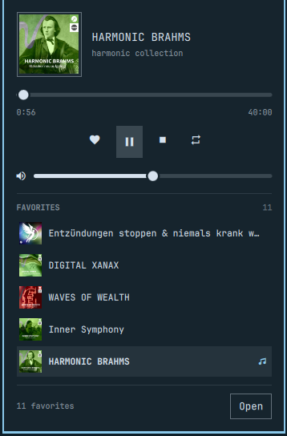
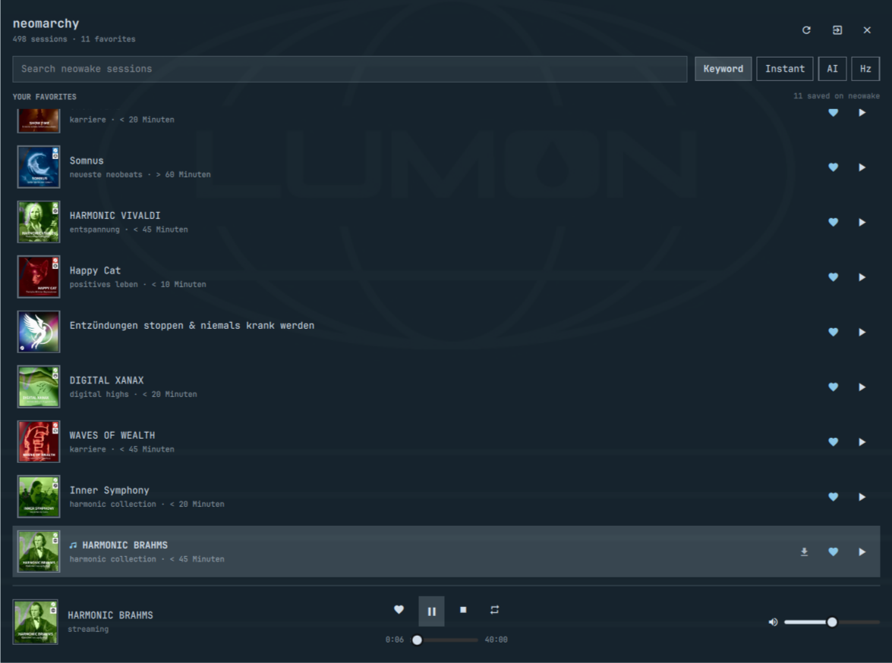

# neomarchy

Search, favorite and play [neowake](https://app.neowake.de/) sessions from the
Omarchy status bar — without opening a browser.


- **Bar widget** with the neowake mark, the running session's title, and a mini
  player that lists your favorites so you can start one in two clicks.
- **Panel** (`Super`-summonable) with four search modes, your favorites, cover
  art, transport and volume.
- **Playback** through `mpv`, which means real MPRIS integration: your media
  keys work, and any other MPRIS client sees the session.
- **Favorites** are read from and written back to your neowake account.
- **Offline**: keep a session on disk and it plays from there next time.

## Screenshots

Click the bar icon for the mini player — now playing plus your favorites, with
the running session kept in view:



The panel adds search, per-row actions and a persistent now-playing footer:



## Requirements

Everything is already on a stock Omarchy box:

| | |
|---|---|
| `mpv` + `mpv-mpris` | playback and media-key integration |
| `python3` | the `bin/neowake` helper (standard library only) |
| `secret-tool` (libsecret) | stores your password in the system keyring |

## Install

```bash
git clone https://github.com/renerocksai/neomarchy ~/code/neomarchy
ln -sfn ~/code/neomarchy ~/.config/omarchy/plugins/org.renerocksai.neomarchy
omarchy plugin validate ~/code/neomarchy   # the real directory, not the symlink
omarchy-shell shell rescanPlugins
omarchy plugin enable org.renerocksai.neomarchy --section right
```

`omarchy plugin add` only takes a git URL and clones a real directory; the
symlink above is the local-development variant of the same thing.

## Sign in

Either from the panel (click the bar icon → **Open** → sign in), or from a
terminal:

```bash
~/.config/omarchy/plugins/org.renerocksai.neomarchy/bin/neowake login
```

It asks for your neowake username (or the email you sign in with) and your
password. The password goes straight into the GNOME keyring via `secret-tool`
and is never written to a config file; the WordPress session cookie lands in
`~/.local/state/neowake/cookies.txt` with mode 600. When the cookie expires the
helper logs in again on its own. If your account has two-factor enabled, the
panel asks for the code (`--otp <code>` on the command line).

## Using it

**Bar icon**

| action | result |
|---|---|
| left click | mini player: now playing + your favorites |
| middle click | play / pause |
| right click | open the full panel |
| scroll | player volume |

**Panel**

The list shows **your favorites** whenever the search box is empty — the
heading above it says which list you are looking at. Type to search; `Esc`
clears the search and puts your favorites back.

| mode | what it searches |
|---|---|
| **Keyword** | neowake's semantic search over the whole library |
| **Instant** | your locally cached catalog, filtered as you type, no network |
| **AI** | describe a goal in a sentence and neowake picks sessions, with a reason per result |
| **Hz** | search by frequency, e.g. `528 Hz` |

Keys: `/` or `Ctrl+F` focus the search box, `↑`/`↓` (or `j`/`k`) move,
`Enter` plays, `Space` pauses, `←`/`→` seek 15 s, `Esc` clears the search or
closes the window.

Each row has a heart (favorite, written back to your account) and a download
arrow (keep the mp3 offline).

## Keybindings

The widget exposes IPC methods, so you can bind anything in
`~/.config/hypr/bindings.lua`:

```bash
omarchy-shell -q org.renerocksai.neomarchy.player toggle        # play/pause
omarchy-shell -q org.renerocksai.neomarchy.player stop
omarchy-shell -q org.renerocksai.neomarchy.player next          # next favorite
omarchy-shell -q org.renerocksai.neomarchy.player previous
omarchy-shell -q org.renerocksai.neomarchy.player volumeUp
omarchy-shell -q org.renerocksai.neomarchy.player volumeDown
omarchy-shell -q org.renerocksai.neomarchy.player miniPlayer    # toggle the popup
omarchy-shell -q org.renerocksai.neomarchy.player playFavorite 0
omarchy-shell -q org.renerocksai.neomarchy.player playSession 280824
omarchy-shell    org.renerocksai.neomarchy.player state         # JSON status
omarchy-shell    shell toggle org.renerocksai.neomarchy '{}'    # the full panel
```

## Settings

Set per-widget in `~/.config/omarchy/shell.json`:

| key | default | |
|---|---|---|
| `showTrackTitle` | `On` | show the session title next to the icon |
| `maxBarTextWidth` | `220` | cap on that title, in px |
| `defaultSearchMode` | `keyword` | which search tab opens first |
| `repeat` | `Off` | loop the running session |
| `cacheOnPlay` | `Off` | keep every played session offline |
| `volumeStep` | `5` | scroll-wheel step, in percent |
| `catalogRefreshDays` | `7` | how often to re-crawl the catalog |

## The helper

`bin/neowake` is a standalone client — the QML never parses HTML and never
touches a credential. Every command prints one JSON object.

```bash
neowake status
neowake catalog [--refresh] [--full]
neowake favorites [--refresh]
neowake fav add|remove|toggle <id>
neowake search <query> [--mode keyword|local|ai|frequency] [--limit N]
neowake resolve <id-or-slug> [--download]
neowake cache add|remove|list [<id>]
neowake enrich [--limit N]        # backfill titles, covers and audio urls
neowake logout [--forget]
```

## How it works

```
BarWidget.qml / Panel.qml   the UI
Service.qml                 state; owns one mpv, driven over its JSON IPC socket
  ├── mpv --idle            plays the CDN url (or the offline copy)
  │     └── mpv-mpris       so media keys and other MPRIS clients see it
  └── bin/neowake           login, catalog, favorites, search, url resolution
```

Session discovery uses neowake's own search API, which needs no login. Your
favorites, the catalog and the audio URLs come from the membership site with
your session cookie. Audio streams from neowake's CDN.

Local data lives in `~/.local/state/neowake/`:

| | |
|---|---|
| `cookies.txt` | the WordPress session (mode 600) |
| `catalog.json` | ~500 sessions: id, slug, categories, cover |
| `details.json` | resolved titles, covers and audio urls |
| `favorites.json` | short-lived cache of the favorite ids |
| `audio/` | offline copies |

Your username is in `~/.config/neowake/config.json`; the password is only ever
in the keyring.

## Developing

Omarchy watches `~/.config/omarchy/plugins` with `inotifywait -r`, which does
**not** follow symlinks — so when the plugin directory is a symlink to a repo
elsewhere, saving a file does not hot-reload it. After an edit:

```bash
omarchy restart shell
```

QML errors go to the journal:

```bash
journalctl -t omarchy-shell -f
```

## License

MIT
